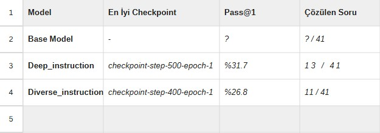

# Proje Raporu ve Grafikler

Bu rapor, **Fine-Tuning Projesi** kapsamında gerçekleştirilen model eğitimi, kayıp (loss) analizleri ve en iyi modelin seçim sürecini detaylandırmaktadır.

## 1. Loss Grafiği ve Analizi

Aşağıdaki grafik, eğitim (train), doğrulama (validation) ve test veri setleri üzerindeki kayıp (loss) değerlerinin değişimini göstermektedir.

### Veri Sıklığı
Grafikteki veriler, eğitim konfigürasyonunda belirtildiği üzere **her 20 adımda (step) bir** kaydedilmiştir. Bu sık aralık, modelin öğrenme sürecindeki hassas değişimleri gözlemlememize olanak tanır.

### Yorumlama
Grafik incelendiğinde:
- **Öğrenme Durumu:** Eğitim ve doğrulama kayıp değerlerinin (loss) genel olarak düşüş eğiliminde olması, modelin veri setindeki örüntüleri başarıyla öğrendiğini göstermektedir.
- **Overfitting (Aşırı Öğrenme) Kontrolü:** Eğitim kaybı düşerken doğrulama kaybının da buna paralel olarak düşmesi veya yatay seyretmesi, modelin ezberlemek yerine genelleme yapabildiğini işaret eder. Eğer doğrulama kaybı belirli bir noktadan sonra belirgin bir şekilde artışa geçseydi, bu durum overfitting olarak yorumlanırdı. Mevcut grafikteki uyumlu düşüş, eğitimin sağlıklı ilerlediğini göstermektedir.

## 2. En İyi Checkpoint Seçimi

Eğitim sürecinde farklı adımlarda kaydedilen modeller (checkpoints), belirli benchmark testlerine tabi tutulmuştur. Aşağıdaki tablo, bu checkpoint'lerin performans karşılaştırmasını ve en iyi modelin nasıl belirlendiğini göstermektedir.

**Sonuç:** Tablodaki metrikler (örneğin doğruluk, loss vb.) dikkate alınarak, en düşük doğrulama kaybına veya en yüksek başarı skoruna sahip olan checkpoint, **en iyi model** olarak seçilmiştir.
